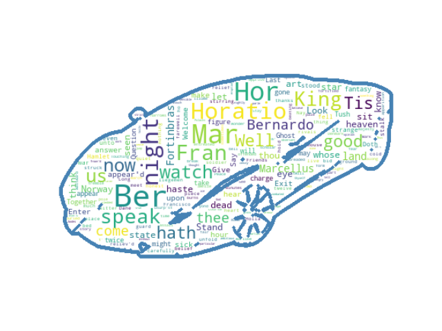

# Generating-Wordclouds-in-Python
Using Python to generate Wordclouds(Firstly removing punctuation marks and unwanted words from text)

# Features:
* Generating wordclouds from user input text(text.txt)
* Prioritizing popular words with size
* Using custom images for the shape of cloud

